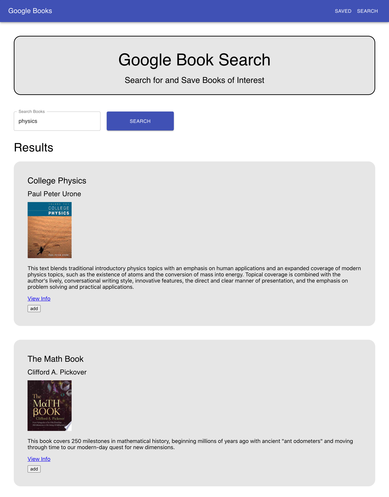

# Homework 21: Google Books Search (React)

## Description
This website application allows a user to search the Google Books API. Results display title, author, image, description, and links to more information. The books also have an option to be saved to the user's collection, where they can be accessed in a separate tab. 

The saved collection displays the books similarly and instead has an option to remove the book.

## Deployed Application (Heroku)
<a href="https://afternoon-hamlet-63363.herokuapp.com/" target="_blank">Google Books Search</a>

## Credits
* HTML
* CSS
* Javascript
* Node.js
* Express
* MongoDB
* Mongoose
* Material UI
* Axios
* React
* React-dom
* React-router-dom
* Cors
* Dot-env
* Heroku

## Portfolio
<a href="https://kdoh52.github.io/" target="_blank">Updated portfolio</a>

## Contact
* kdoh52@gmail.com
